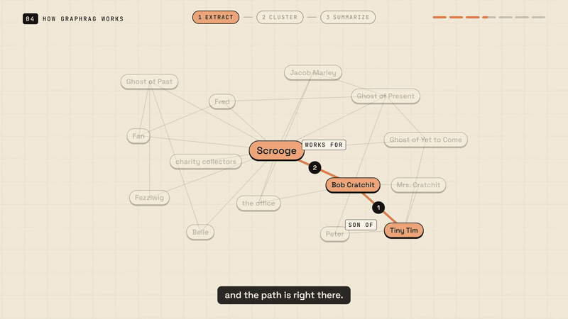

# explainer-video-opus-5.5

A Claude Code skill that makes motion-design explainer videos: you give it a topic, it researches
it, writes the narration, animates every scene in HTML and GSAP, voices it, and renders an MP4.
16:9 for YouTube or 9:16 for Shorts. Everything runs locally and free.

The core idea: every animation is keyed to a **beat** of the narration (a line, or a
single word), never to raw seconds. Swap the AI voice for your own recording and the whole video
retimes itself to how you actually talk.



*Scenes from [`examples/rag-vs-graphrag`](examples/rag-vs-graphrag) and [`examples/jev`](examples/jev),
both made with this skill. With sound: [the 33-second template video](https://github.com/RohanRatwani/explainer-video-opus-5.5/releases/download/v0.1.0/template-demo.mp4)
(MP4, 8 MB, AI voice), which is exactly what your first render will look like.*

## What you get per video
- `brief.md`: every fact in the video, with its source
- `script.md`: the scene table to approve before anything gets built
- an MP4 (1080p, -14 LUFS audio), `captions.srt`, `chapters.txt`, and a `youtube.md` upload package

## Install
```sh
git clone https://github.com/RohanRatwani/explainer-video-opus-5.5 ~/.claude/skills/explainer-video     # all your projects
# or, for one project only:  git clone ... .claude/skills/explainer-video
```
Then, in any folder, ask Claude Code: **"Make an explainer video about how vector search works."**
The skill sets up a workspace, checks your tools, and walks you through two checkpoints: the
script, then the first render.

### Requirements
- Node 20+, ffmpeg
- [HyperFrames](https://github.com/heygen-com/hyperframes) (fetched by `npx` on first use)
- For voice (optional): Python 3.10+ and `pip install -r requirements.txt`, then
  `npx hyperframes tts "hello" -o hello.wav` once to download the Kokoro model
- Windows: turn on Developer Mode, or video renders fail with a symlink error

Tested end to end on Windows 11. macOS and Linux should work but are untested so far; issues welcome.

`node engine/doctor.mjs` checks all of it and prints the fix for anything missing.

## By hand
```sh
node engine/init.mjs ~/videos          # a workspace for your videos
cd ~/videos && node engine/new.mjs my-topic
cd videos/my-topic && node build.mjs   # silent cut + script.md
cd edit && npx --yes hyperframes render -o ../renders/my-topic-v1.mp4
```
The template is a short video (about 35 seconds) about how this skill works. Render it first; then replace its beats.

## Your own voice
`node engine/read-aloud.mjs videos/my-topic` writes a script to read aloud. Read it in one take,
redo any fumbled sentence, and `engine/split-take.py` keeps the last try of every line. No need
to match the video's pace: the video matches yours.

## Credits
Built on [HyperFrames](https://github.com/heygen-com/hyperframes) (Apache-2.0),
[GSAP](https://gsap.com), [Kokoro](https://huggingface.co/hexgrad/Kokoro-82M) via
[kokoro-onnx](https://github.com/thewh1teagle/kokoro-onnx), and
[faster-whisper](https://github.com/SYSTRAN/faster-whisper). Fonts: Space Grotesk, Instrument
Serif, JetBrains Mono (SIL Open Font License, see `fonts/`).

Built and tested with Claude Opus 5.5 in Claude Code. Unofficial community project, not affiliated
with Anthropic. MIT licensed.
